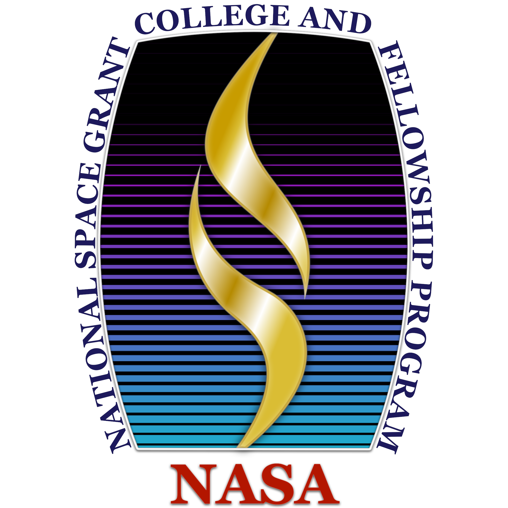

<!--
*** Thanks for checking out this README Template. If you have a suggestion that would
*** make this better, please fork the repo and create a pull request or simply open
*** an issue with the tag "enhancement".
*** Thanks again! Now go create something AMAZING! :D
-->


<!-- PROJECT SHIELDS -->
<!--
*** I'm using markdown "reference style" links for readability.
*** Reference links are enclosed in brackets [ ] instead of parentheses ( ).
*** See the bottom of this document for the declaration of the reference variables
*** for contributors-url, forks-url, etc. This is an optional, concise syntax you may use.
*** https://www.markdownguide.org/basic-syntax/#reference-style-links
-->
<!--
[![Contributors][contributors-shield]][contributors-url]
[![Forks][forks-shield]][forks-url]
[![Stargazers][stars-shield]][stars-url]
[![Issues][issues-shield]][issues-url]
[![MIT License][license-shield]][license-url]
[![LinkedIn][linkedin-shield]][linkedin-url]
-->


<!-- PROJECT LOGO -->
<br />
<p align="center">
  <a href="https://github.com/CodeyWinslow/optimized-learning-vr">
    
  </a>

  <h3 align="center">Optimized Learning with Virtual Reality</h3>

  <p align="center">
    Oregon Space Grant Consortium virtual internship on optimized learning with VR. In this research project, I aimed to discover whether or not virtual reality better aids in learning procedural skills.
  </p>
</p>

<!-- ABOUT THE PROJECT -->
## About The Project

[![Product Name Screen Shot][product-screenshot]]

The purpose of this project was the investigate the viability of VR technology as an educational device for industry skills. More specifically, to teach skills that require some kind of environmental interaction that would be expensive to mock. I would do this by setting up an experiment where subjects would learn using a VR application I develop.

### Built With
This section should list any major frameworks that you built your project using. Leave any add-ons/plugins for the acknowledgements section. Here are a few examples.
* [Unity](https://unity.com/)


<!-- GETTING STARTED -->
## Getting Started

If you would like to see the work done for this project, follow the steps to install on your system.

### Prerequisites

You will need the following to fully realize the work done for this project:
* [Unity Game Engine](https://unity.com/)
* IDE, preferably Visual Studio 2019 or newer
* SteamVR-compatible virtual reality headset and controller
* [SteamVR](https://store.steampowered.com/app/250820/SteamVR/)

### Installation

1. Clone the repo
```sh
git clone https://github.com/CodeyWinslow/optimized-learning-vr.git
```


<!-- USAGE EXAMPLES -->
## Usage

Open Unity and location the project inside optimized-learning-vr/OSGC_UI/ or optimized-learning-vr/OSGC_VR/

Ensure any critical errors are confronted before building.

To build, open build settings, then click build.

Run executable in build directory.

<!-- CONTRIBUTING -->
## Contributors

* [Codey Winslow](https://github.com/CodeyWinslow)

<!-- CONTACT -->
## Contact

Codey Winslow - [email me](mailto:codeywinslow@gmail.com)

Project Link: [https://github.com/CodeyWinslow/optimized-learning-vr](https://github.com/CodeyWinslow/optimized-learning-vr)


<!-- ACKNOWLEDGEMENTS -->
## Acknowledgements
* [Img Shields](https://shields.io)

<!-- MARKDOWN LINKS & IMAGES -->
<!-- https://www.markdownguide.org/basic-syntax/#reference-style-links -->
<!--
[contributors-shield]: https://github.com/CodeyWinslow/optimized-learning-vr.svg?style=flat-square
[contributors-url]: https://github.com/CodeyWinslow/optimized-learning-vr/graphs/contributors
[forks-shield]: https://github.com/CodeyWinslow/optimized-learning-vr.svg?style=flat-square
[forks-url]: https://github.com/CodeyWinslow/optimized-learning-vr/network/members
[stars-shield]: https://github.com/CodeyWinslow/optimized-learning-vr.svg?style=flat-square
[stars-url]: https://github.com/CodeyWinslow/optimized-learning-vr/stargazers
[issues-shield]: https://github.com/CodeyWinslow/optimized-learning-vr.svg?style=flat-square
[issues-url]: https://github.com/CodeyWinslow/optimized-learning-vr/issues
[license-shield]: https://github.com/CodeyWinslow/optimized-learning-vr.svg?style=flat-square
[license-url]: https://github.com/othneildrew/Best-README-Template/blob/master/LICENSE.txt
-->
[linkedin-shield]: https://img.shields.io/badge/-LinkedIn-black.svg?style=flat-square&logo=linkedin&colorB=555
[linkedin-url]: https://linkedin.com/in/codeywinslow
[product-screenshot]: Images/UI_Screenshot.png
